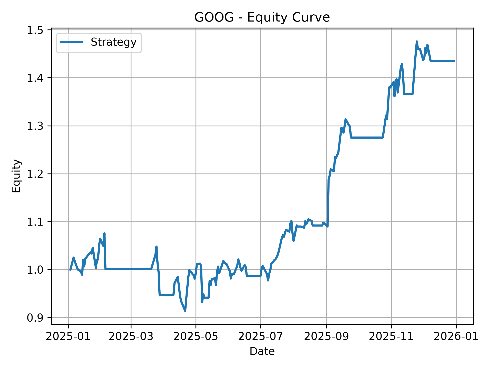
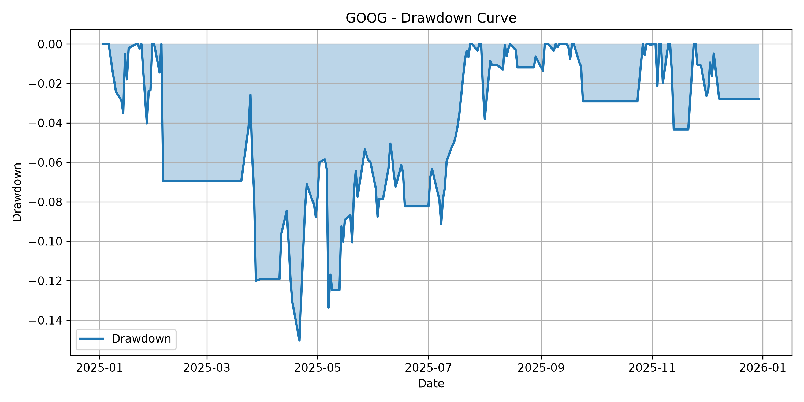

# Financial Market Intelligence

**Part of the Quant Ecosystem** — a modular collection of quantitative finance projects for research, portfolio optimization, and systematic trading.

---

## Introduction

Financial Market Intelligence is a modular quantitative research platform designed to develop, evaluate, and analyze systematic trading strategies.

The project provides an end-to-end workflow covering market data acquisition, feature engineering, technical indicators, signal generation, strategy execution, backtesting, performance evaluation, trade analytics, and reporting. It is designed with extensibility in mind, allowing new indicators, strategies, and execution models to be integrated with minimal changes to the existing architecture.

This project serves as the foundation of the **Quant Ecosystem**, a long-term collection of quantitative finance projects focused on systematic research, intelligent portfolio construction, and quantitative trading.

---

## Features

* Modular market data pipeline
* Data validation and preprocessing
* Extensible technical indicator framework
* Strategy abstraction layer
* Signal generation engine
* Trade execution engine
* Vectorized backtesting
* Performance analytics (Sharpe Ratio, CAGR, Annualized Volatility, Maximum Drawdown)
* Trade analysis and statistics
* Human-readable reporting
* Hyperparameter grid search
* Equity curve and drawdown visualization

---

## Architecture

```text
Market Data
     │
     ▼
Validation & Normalization
     │
     ▼
Feature Engineering
     │
     ▼
Technical Indicators
     │
     ▼
Trading Strategy
     │
     ▼
Signal Generation
     │
     ▼
Execution Engine
     │
     ▼
Backtesting
     │
     ▼
Performance Metrics
     │
     ▼
Trade Analysis
     │
     ▼
Reporting & Visualization
```
The project follows a modular pipeline architecture where each component has a single responsibility. Market data flows through validation, preprocessing, feature engineering, strategy execution, and performance evaluation before producing analytical reports and visualizations. This design makes the framework highly extensible and simplifies the integration of new strategies, indicators, and execution models.


## Project Structure

```text
financial-market-intelligence/
│
├── src/
│   └── financial_market_intelligence/
│       ├── analysis/          # Performance metrics and trade analytics
│       ├── backtesting/       # Backtesting engine
│       ├── data/
│       │   ├── interfaces/    # Abstract market data interfaces
│       │   ├── processing/    # Data validation and normalization
│       │   └── providers/     # Market data providers (Yahoo Finance)
│       ├── execution/         # Execution
│       ├── features/          # Feature engineering
│       ├── indicators/        # Technical indicators
│       ├── models/            # Core data models and dataclasses
│       ├── optimization/      # Grid search and strategy builders
│       ├── reporting/         # Professional report generation
│       ├── signals/           # Signal generation
│       ├── strategies/        # Trading strategies
│       └── visualization/     # Equity and drawdown visualization
│
├── reports/                   # Generated reports and plots
├── main.py                    # Project entry point
├── pyproject.toml
└── README.md
```

The project follows a modular architecture where every package has a single responsibility. This separation improves maintainability, simplifies testing, and allows new components—such as indicators, strategies, execution models, or data providers—to be integrated without affecting the rest of the framework.

## Usage

Configure the symbols, strategy, and backtesting period in main.py, then run:
```bash
uv run python main.py
```

The framework automatically performs the following steps:

1. Downloads historical market data.
2. Validates and preprocesses the dataset.
3. Computes technical indicators.
4. Generates trading signals.
5. Executes the selected strategy.
6. Runs the backtest.
7. Computes performance and trade statistics.
8. Generates a human-readable report.
9. Produces equity and drawdown visualizations.
10. Exports grid search results.

## Example Report

A sample performance report generated by the framework:

```text id="bnm01q"
TRADE SUMMARY

Symbol: GOOG
Strategy: MACDStrategy

Total Trades: 10
Win Rate: 70.00%

Total Return: 43.49%
Sharpe Ratio: 1.42
Maximum Drawdown: 15.03%
```
## Generated Outputs

The framework automatically generates the following artifacts:

```text id="o3d6ht"
reports/
├── report.txt
├── strategy_results.csv
└── plots/
    ├── equity_curve.png
    └── drawdown_curve.png
```
## Results Visualization

Example figures generated by the framework.

### Equity Curve



### Drawdown Curve


## Roadmap

* [x] Modular project architecture
* [x] Market data pipeline
* [x] Technical indicators
* [x] Strategy abstraction
* [x] Signal generation
* [x] Trade execution engine
* [x] Vectorized backtesting
* [x] Performance analytics
* [x] Trade analysis
* [x] Professional reporting
* [x] Grid search optimization
* [ ] Transaction cost modeling
* [ ] Position sizing models
* [ ] Advanced risk management module
* [ ] Portfolio-level backtesting
* [ ] Multi-asset execution
* [ ] Walk-forward validation
* [ ] Parallel strategy optimization


## Quant Ecosystem

Financial Market Intelligence is the first project of the **Quant Ecosystem**, a long-term collection of quantitative finance projects designed to cover the complete quantitative investment workflow.

The ecosystem consists of three complementary projects:

* **Financial Market Intelligence** — Strategy research, market analysis, and backtesting.
* **Intelligent Portfolio Construction Engine** — Portfolio optimization, asset allocation, and risk management.
* **Quantitative Trading Research Lab** — Machine learning research, alpha discovery, and quantitative trading experiments.

Together, these projects form an integrated ecosystem for systematic quantitative finance research.

## Contributing

Contributions, suggestions, and feedback are welcome.

If you would like to improve the project, feel free to open an issue or submit a pull request.

## License

This project is licensed under the MIT License.

